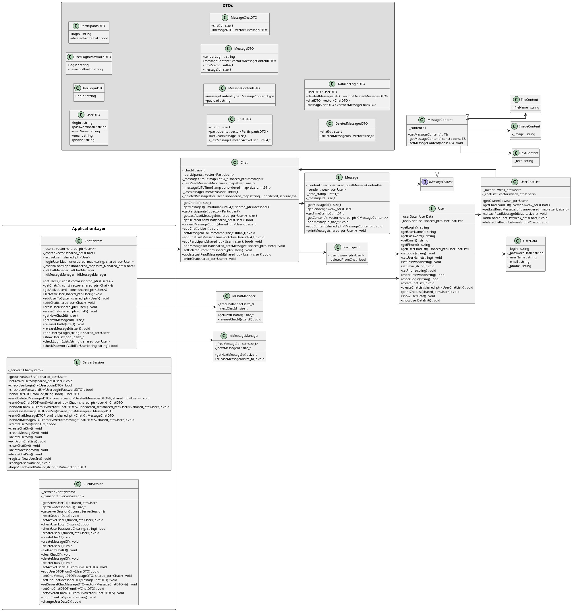

# 💬 ChatBot SHARK v 3.0 2025 made by Yan Batytskiy

**ChatBot** — это клиент-серверная версия TCP система чатов на C++20.
 Поддерживает регистрацию пользователей, авторизацию, создание чатов и отправку сообщений. 
 Клиентская часть построена на модульной архитектуре с использованием `smart pointers` и пользовательских исключений. 
 Серверная часть построена на архитектуре SQL запросов к базе данных PostgreSQL и сериализации ответа на запрос.
 Клиентская часть умеет автоматически искать серверную часть на локальной машине, в локальной сети.

 Клиентская часть будет переведена на SQL Lite в следующих версиях.

 На данный момент система стабильно работает только под Linux.

---

## 🧱 Структура проекта

```
ChatBot/
├── CMakeLists.txt
├── dist/ # Сборка под Linux
├── src/
│ ├── client/
│ │ └── menu/
│ ├── core/
│ │ ├── chat/
│ │ ├── chat_system/
│ │ ├── exception/
│ │ ├── message/
│ │ ├── system/
│ │ └── user/
│ ├── dto/
│ └── server/
├── build/ # Временные CMake-файлы
└── README.md```

## 📦 Изменения архитектуры

1. Серверная часть полностью переведена на работу с базой данных PostgreSQL.

2. В демонстрационных целях развернута тестовая база, которая принудительно 
	пересоздается и инициализируется тестовыми данными.
	База расположена в облаке Amazon, для доступа из России может понадобиться ВПН.

3. Для подключения базы на сервере баз данных пользователя необходимо прописать данные 
	для доступа в файл connect_db.conf и разместить этот файл 
	в папке запуска серверной части программы.
	Серверная часть самостоятельно очистит и пересоздаст схему в базе и заполнит
	исходными данными.

## 📦 Классы и связи

для клиентской части


---

## ⚙️ Требования

- C++20-совместимый компилятор (`g++`, `clang++`, `MSVC`)
- `CMake` версии **3.16+**
- (рекомендуется) `clangd` для автодополнения и анализа
- PostreSQL (тестовая база имеет версию 17.4)

---

## 🛠️ Сборка и запуск

### 🔧 1. Конфигурация проекта

### 📂 Скрипты

### 🧪 2. Сборка
```bash
cmake --build build
```
## запуск
---
1. Из папки dist скопировать исполняемые файлы
2. Положить конфигурационный файл 'connect_db.conf' в папку
	к файлу server
3. При подключении к собственному серверу PostgreSQL изменить
	параметры подключения в 'connect_db.conf'
---

## 📷 Скриншот (пример)

```text
ChatBot 'Shark' Версия 3.0. @2025

1. Регистрация пользователя
2. Войти в ЧатБот
0. Завершить программу
```

---

## 📚 Лицензия

MIT License
